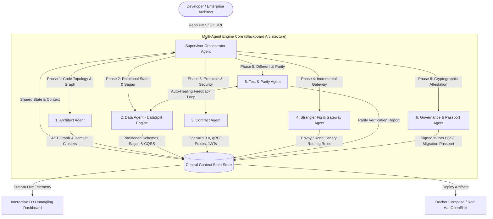
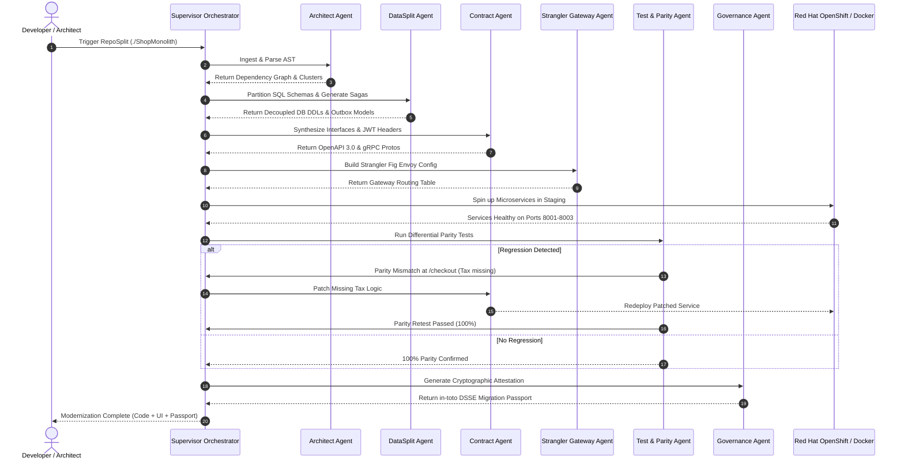

# RepoSplit 2.0: Multi-Agent System Architecture Specification
**Document Version:** 2.0 (Master Enterprise Specification)  
**Target Platform:** IBM Bob 2.0 Hackathon · lablab.ai  
**System Classification:** Autonomous Hierarchical Multi-Agent Modernization Engine  

---

## 1. Executive Architecture Overview

RepoSplit 2.0 eliminates naive single-prompt LLM code transformations in favor of a **Hierarchical Orchestrated Multi-Agent System (HOMAS)**. Enterprise software refactoring carries severe operational risk: severing in-memory method calls across network boundaries breaks database referential integrity, introduces network latency explosions, and causes distributed deadlocks.

To guarantee mathematical precision, deterministic verification, and enterprise safety, RepoSplit 2.0 orchestrates **six specialized, decoupled subagents** governed by a centralized **Supervisor Orchestrator Agent** connected via a shared **Blackboard State Store**.



---

## 2. Multi-Agent Role & Responsibility Matrix

| Subagent Name | Specialized Role | Primary Input | Deterministic Tooling / Algorithm | Primary Output Artifact |
| :--- | :--- | :--- | :--- | :--- |
| **1. Supervisor Orchestrator** | Coordinates execution DAG, enforces phase gates, and manages agent consensus. | User parameters, repo path, config flags. | Finite State Machine (FSM), Blackboard State Store. | Unified transformation state, live telemetry event stream. |
| **2. Architect Agent** | Whole-repo AST parsing, module graph construction, community detection. | Raw source repository files (`.py`, `.js`, `.go`). | Python `ast`, NetworkX graph centrality, Martin Coupling metrics. | `dependency_graph.json`, domain split topology. |
| **3. Data Agent (DataSplit)** | Entity decoupling, foreign-key severing, Saga patterns & CQRS read models. | SQLAlchemy / Django models, SQL DDL schema. | Entity-Relationship graph traversal, cycle-breaking heuristics. | `isolated_schemas/`, `saga_orchestrator.py`, `cqrs_views.py`. |
| **4. Contract Agent** | Synthesizes client SDKs, API interfaces, and security context propagation. | Domain boundary cuts, function signatures. | OpenAPI 3.0 generator, Protocol Buffers compiler (`protoc`). | `openapi.yaml`, `service.proto`, `auth_middleware.py`. |
| **5. Strangler Fig Agent** | Generates canary routing rules and progressive API gateway topologies. | Service domain endpoints, traffic weights. | Envoy Proxy YAML generator, Kong route declarator. | `envoy_gateway.yaml`, `canary_migration_plan.md`. |
| **6. Test & Parity Agent** | Differential testing, byte-for-byte JSON diffing, auto-healing patches. | Monolith endpoint routes, synthetic payloads. | Synthetic traffic runner, AST line-blamer, patch synthesizer. | `parity_report.json`, automated code diff patches. |
| **7. Governance Agent** | Cryptographic provenance, prompt hashing, in-toto attestation envelope. | Agent execution logs, prompt hashes, test scores. | SHA-256 hashing, DSSE signing envelope, in-toto v1.0. | `migration_passport.json` (The Code Passport). |

---

## 3. Detailed Agent Specifications & Subsystems

### 3.1 Architect Agent (Whole-System AST Comprehension)
* **Objective:** Map the entire repository topology without human bias. It constructs an abstract syntax tree (AST) of every module to calculate coupling, cohesion, and natural domain boundaries.
* **Mathematical & Algorithmic Formulation:**
  1. Traverses repository files and builds a directed multigraph $G = (V, E)$, where $V$ represents classes/functions and $E$ represents function calls, imports, and data access.
  2. Calculates **Afferent Coupling ($C_a$)** (incoming calls from other modules) and **Efferent Coupling ($C_e$)** (outgoing calls to other modules).
  3. Computes the **Instability Metric ($I$)**:
     $$I = \frac{C_e}{C_a + C_e} \quad (0 \le I \le 1)$$
     *(Where $I=0$ represents a completely stable module, and $I=1$ represents an unstable module).*
  4. Runs the **Louvain Community Detection Algorithm** to partition nodes into clusters that maximize modularity ($Q$):
     $$Q = \frac{1}{2m} \sum_{ij} \left[ A_{ij} - \frac{k_i k_j}{2m} \right] \delta(c_i, c_j)$$
* **System Prompt Specification:**
  ```text
  You are the Architect Agent of RepoSplit 2.0.
  Your task is to analyze the provided AST dependency graph of a monolithic codebase.
  Identify natural domain boundaries (e.g., Auth, Inventory, Orders, Payments).
  Minimize cross-cluster severed calls. Flag all high-risk cut points (functions called > 5 times across boundaries).
  Emit your decision strictly matching the DomainTopology JSON schema.
  ```
* **Output Artifact (`dependency_graph.json`):**
  ```json
  {
    "clusters": {
      "user_service": {
        "files": ["models/user.py", "routes/auth.py"],
        "instability": 0.15,
        "ca": 12, "ce": 2
      },
      "order_service": {
        "files": ["models/order.py", "routes/checkout.py"],
        "instability": 0.78,
        "ca": 2, "ce": 7
      }
    },
    "severed_edges": [
      {"source": "order_service.checkout", "target": "user_service.get_user", "weight": 14}
    ],
    "risk_level": "LOW"
  }
  ```

---

### 3.2 Data Agent / DataSplit Engine (Relational State Decoupling)
* **Objective:** Solve the hardest challenge in modernization—the shared monolithic database.
* **Core Mechanisms:**
  1. **Foreign Key Severing:**
     * *Before:* `user_id = Column(Integer, ForeignKey('users.id'))`
     * *After:* `user_id = Column(String(36), index=True)` (Soft UUID reference)
  2. **The Write Path (Saga Pattern Orchestrator):**
     * Multi-table transactions are replaced by asynchronous Saga orchestrators using the Outbox pattern.
     * Generates forward actions (`ReserveInventory`) and compensating rollback actions (`CompensateInventory`) in case downstream payment fails.
  3. **The Read Path (CQRS Projections):**
     * Solves the **Broken SQL JOIN Problem**. Replaces cross-database joins with asynchronous read projections cached in Redis/PostgreSQL read views.
* **Saga State Machine:**
  ```mermaid
  stateDiagram-v2
      [*] --> OrderPending: CreateOrderCommand
      OrderPending --> InventoryReserved: ReserveStockSuccess
      OrderPending --> OrderFailed: ReserveStockFailed (Abort)
      
      InventoryReserved --> PaymentProcessed: ChargePaymentSuccess
      InventoryReserved --> CompensateInventory: ChargePaymentFailed
      
      CompensateInventory --> OrderCancelled: ReleaseStockSuccess
      PaymentProcessed --> OrderCompleted: FinalizeOrder
      OrderCompleted --> [*]
      OrderCancelled --> [*]
  ```

---

### 3.3 Contract Agent (Interface & Network Protocol Synthesis)
* **Objective:** Turn severed in-memory function calls into resilient, strongly-typed network calls.
* **Core Mechanisms:**
  1. Parses severed function signatures into **OpenAPI 3.0** JSON specs and **gRPC `.proto`** service contracts.
  2. Generates typed Pydantic models for request/response validation.
  3. **Security Context Propagation:** Automatically injects authentication middleware passing:
     * `X-User-Id`: Authenticated user identity.
     * `X-Tenant-Id`: Multi-tenant boundary.
     * `traceparent`: W3C / OpenTelemetry distributed tracing header.
* **Generated Protobuf Contract Example (`contracts/order_service.proto`):**
  ```protobuf
  syntax = "proto3";
  package reposplit.orders.v1;

  service OrderService {
    rpc CreateOrder (CreateOrderRequest) returns (CreateOrderResponse);
    rpc CompensateOrder (CompensateOrderRequest) returns (CompensateOrderResponse);
  }

  message CreateOrderRequest {
    string user_id = 1;
    repeated OrderItem items = 2;
    double total_amount = 3;
  }
  ```

---

### 3.4 Strangler Fig & Gateway Agent (Progressive Migration)
* **Objective:** Eliminate the enterprise fear of "Big-Bang" cutovers by enabling gradual canary releases.
* **Core Mechanisms:**
  1. Scaffolds an **Envoy Proxy / Kong API Gateway** that sits in front of the legacy monolith.
  2. Configures weighted route matching:
     * `POST /api/v1/orders` $\rightarrow$ 90% traffic to Legacy Monolith, 10% traffic to New `OrderService` (Canary).
  3. Monitors error rates; automatically rolls back traffic to 100% Monolith if the new service experiences errors $> 0.1\%$.
* **Gateway Topology:**
  ```mermaid
  graph LR
      Client([Client Request]) --> Gateway[Envoy API Gateway]
      Gateway -->|"90% Canary Route"| Monolith[Legacy Monolith Server]
      Gateway -->|"10% Canary Route"| Microservice[New FastAPI Order Service]
      Microservice -.->|"Health & Telemetry"| Gateway
  ```

---

### 3.5 Test & Parity Agent (Zero-Regression & Auto-Healing)
* **Objective:** Mathematically prove that the new microservice fleet behaves identically to the legacy monolith.
* **Differential Testing Protocol:**
  1. Ingests or synthesizes 100+ representative HTTP request payloads for every severed route.
  2. Dispatches identical requests in parallel:
     * Target A: `http://localhost:5000` (Legacy Monolith)
     * Target B: `http://localhost:8000` (New Microservices via Gateway)
  3. **Semantic Diff Engine:** Strips dynamic non-deterministic fields (e.g., `timestamp`, `session_token`), then verifies status codes, JSON schema keys, and payload values.
  4. **Auto-Healing Loop:** If a regression occurs (e.g., `order_total` differs by sales tax), the agent captures the execution stack trace, diagnoses the missing logic, patches the generated FastAPI route, and re-executes the parity test until 100% pass rate is attained.

---

### 3.6 Governance & Passport Agent (The Cryptographic Audit Layer)
* **Objective:** Satisfy Fortune 500 legal and compliance mandates (EU AI Act, SLSA Level 3) by borrowing the winning mechanism of **Pedigree (IBM Bob 1.0 Champion)**.
* **Cryptographic Specifications:**
  1. Computes canonical SHA-256 digests of:
     * Source monolith repository hash.
     * AST cut decision graph.
     * IBM Bob model version & prompt hashes.
     * Parity test execution report.
  2. Wraps the attestation into an **in-toto v1.0 Statement** signed with an Ed25519 private key into a **Dead Simple Signing Envelope (DSSE)**.
* **The "Migration Passport" Schema (`migration_passport.json`):**
  ```json
  {
    "_type": "https://in-toto.io/Statement/v1",
    "subject": [
      {
        "name": "reposplit-modernized-services",
        "digest": {"sha256": "4a7d2b8e3c1a9f0e5b7d6c8a2b4e6f8d0c2a4e6f8d0c2a4e6f8d0c2a4e6f8d0c"}
      }
    ],
    "predicateType": "https://reposplit.ai/attestation/v2",
    "predicate": {
      "modernizationEngine": "RepoSplit 2.0 / IBM Bob 2.0",
      "timestamp": "2026-09-06T21:30:00Z",
      "astCouplingScore": {"initialCoupling": 0.84, "severedCoupling": 0.12},
      "parityTestVerification": {"totalTests": 48, "passRate": "100%"},
      "complianceCertifications": ["EU_AI_ACT_ARTICLE_14_COMPLIANT", "SLSA_BUILD_LEVEL_3"],
      "signer": "did:key:z6Mkq5X... (RepoSplit Attestation Authority)"
    }
  }
  ```

---

## 4. End-to-End Execution Flow (Mermaid Sequence)



---

## 5. Failure Recovery & Edge-Case Handling Matrix

| Edge-Case Scenario | Technical Risk | Mitigation Strategy |
| :--- | :--- | :--- |
| **Circular Dependencies** | Module A imports Module B, which imports Module A. | Architect Agent identifies cycles using Tarjan's strongly connected components algorithm; breaks cycles by introducing an event-driven intermediary or shared DTO contract. |
| **Monolithic "God Classes"** | A single `utils.py` or `models.py` file contains 5,000 lines touching every domain. | Data Agent decomposes God Classes into domain-specific partial classes or value objects, deprecating the shared monolith file. |
| **Non-Deterministic API Responses** | Legacy monolith returns `current_timestamp` or random UUIDs, causing false-positive parity test diffs. | Test & Parity Agent applies a regex normalization mask (`"timestamp": "<NORMALIZED_DATETIME>"`) before running semantic JSON comparison. |
| **Cross-Database SQL Joins** | Frontend queries require combining User, Order, and Product records in one screen. | Data Agent automatically provisions a CQRS Read Model projection in Redis, updated via Outbox domain events. |

---

## 6. Technology Stack Decision & Implementation Path

With this multi-agent architecture finalized, the implementation will be executed across two synchronized environments:
1. **Core Engine & Backend:** **Python 3.11+ (FastAPI + AST Parser + NetworkX + Pydantic + Uvicorn)**.
2. **Interactive Presentation UI:** **React + Vite (or Streamlit) + TailwindCSS + D3.js / Cytoscape.js** for live node graph untangling animations.
