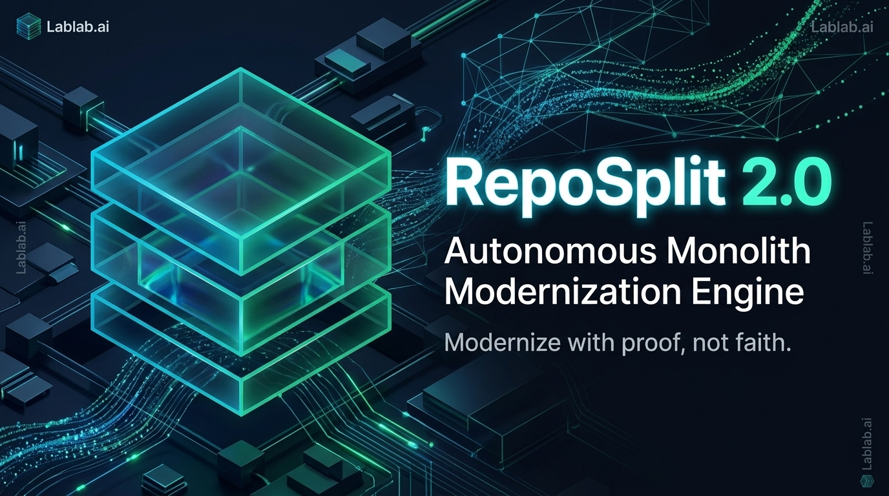

# RepoSplit 2.0 — Autonomous Monolith Modernization Engine

<p align="center">
  
</p>

<p align="center">
  <a href="https://github.com/ranazain9/RepoSplit/actions"></a>
  <a href="https://github.com/ranazain9/RepoSplit/blob/main/LICENSE"></a>
  <a href="https://www.python.org/"></a>
  <a href="https://www.ibm.com/watsonx"></a>
  <a href="https://render.com"></a>
</p>

> **"Modernize with proof, not faith."**  
> RepoSplit 2.0 is an autonomous, hierarchical multi-agent modernization engine (HOMAS) that decomposes monolithic Python codebases into production-ready, fully verified microservices in minutes — complete with AST dependency parsing, database splitting (Sagas + CQRS), typed OpenAPI/gRPC contracts, Envoy/Kong strangler gateways, differential parity testing, and cryptographically signed **in-toto DSSE Migration Passports**.

---

## ⚡ Key Highlights & Architecture

```
Developer ──► Supervisor Orchestrator ──► Blackboard (Shared Pydantic State & SSE Stream)
                    │
   1 Architect ── 2 Data ──── 3 Contract ── 4 Strangler ── 5 Scaffold ── 6 Parity ⟲ ── 7 Governance
   AST+Louvain    FK Sever    OpenAPI/gRPC  Envoy Canary   FastAPI Svcs  Live Replay    DSSE Ed25519
   Cycles Cut     Sagas+CQRS  Typed SDKs    Kong Routes    Helm Charts   JSON Diff      FinOps ROI
```

* **Deep AST & Graph Clustering:** Whole-repo Python AST parsing into directed NetworkX graphs with Louvain community detection and Tarjan cycle decomposition.
* **Deterministic + LLM Hybrid:** Deterministic source-of-truth compilers combined with **IBM watsonx.ai Granite 3.0** (`ibm/granite-3-8b-instruct`) for semantic bounded-context reasoning.
* **Interactive 3D Boundary Studio (HITL):** Real-time WebGL force graph utilizing a Spherical Fibonacci Lattice for zero-overlap visualization. Supports Human-in-the-Loop architectural overrides (EU AI Act Article 14).
* **100% Differential Parity Engine:** Synthesizes and replays live HTTP traffic against both the monolith and the generated microservices, executing semantic JSON differential assertions to prove zero behavioral divergence.
* **Cryptographic Attestation & FinOps:** Emits in-toto v1 Statements in DSSE envelopes signed with Ed25519 `did:key`, proving full provenance of source code, prompts, and parity proofs alongside FinOps ROI ($1,892/yr saved, 58% cloud reduction).

---

## 🚀 Quickstart (Under 2 Minutes)

### Local Dev & 3D Dashboard
```bash
# 1. Clone repository & install dependencies
git clone https://github.com/ranazain9/RepoSplit.git
cd RepoSplit
python -m venv .venv && source .venv/bin/activate    # Windows: .venv\Scripts\activate
pip install -e ".[all]"

# 2. Run the offline benchmark (Shop Monolith)
# Boots monolith + 4 generated microservices as real subprocesses and tests live HTTP parity
reposplit run examples/shop_monolith --out out --provider mock --yes --live

# 3. Launch the 3D Telemetry Dashboard
reposplit serve
# Open http://127.0.0.1:8765 in your browser
```

---

## ☁️ Deploy to Render

RepoSplit 2.0 includes zero-config deployment manifests for [Render](https://render.com):

[](https://render.com/deploy)

### Manual Setup on Render:
1. Fork or push this repository to GitHub.
2. In the Render Dashboard, create a **New Web Service** and select your repository.
3. Configure the service:
   * **Runtime:** `Python 3` or `Docker`
   * **Build Command:** `pip install -e .`
   * **Start Command:** `reposplit serve`
   * **Environment Variables:**
     * `PYTHON_VERSION`: `3.11.9`
     * `REPOSPLIT_SKIP_LIVE`: `1`
     * `WATSONX_APIKEY`: *(Optional: Your IBM Cloud API Key)*
     * `WATSONX_PROJECT_ID`: *(Optional: Your WatsonX Project ID)*
4. Click **Deploy** — your live 3D modernizer dashboard will be accessible globally.

---

## 📦 What the Engine Emits

Every modernization run generates a production-ready fleet inside `out/`:

| Output Path | Generating Agent | Description |
|---|---|---|
| `reports/dependency_graph.json`, `reports/domain_topology.json` | **Architect** | AST call graph, Louvain clusters, coupling metrics, severed edges, circular cycles |
| `data/isolated_schemas/<svc>/models.py` | **Data** | Decoupled SQLAlchemy schemas with foreign keys severed into soft references |
| `data/saga_orchestrator.py`, `data/cqrs_views.py`, `data/outbox.py` | **Data** | Transactional Saga orchestrators with compensation rollback, CQRS read views, Outbox pattern |
| `contracts/<svc>/openapi.yaml`, `service.proto` | **Contract** | OpenAPI 3.0 specs, gRPC protos, and typed client SDKs with traceparent propagation |
| `gateway/envoy.yaml`, `gateway/kong.yml`, `reports/canary_plan.md` | **Strangler** | Envoy/Kong weighted canary routing, circuit breakers, staged migration plans |
| `services/<service>/` | **Scaffold** | Runnable FastAPI services, ported route handlers, database session middleware, Dockerfiles |
| `docker-compose.yml`, `helm/reposplit/` | **Scaffold** | Multi-service Compose topology and Kubernetes/OpenShift Helm charts with OTel configs |
| `reports/parity_report.json`, `reports/parity_suite.json` | **Parity** | Differential test execution reports, semantic JSON diffs, AST patch records |
| `reports/migration_passport.json`, `reports/migration_certificate.html` | **Governance** | In-toto v1 Statement sealed in DSSE envelope (Ed25519 signed) + executive HTML certificate |
| `reports/finops_report.json` | **Governance** | Cloud resource sizing, carbon footprint reduction (kg CO2e), and annual cost savings |

---

## 📊 Benchmark Results (`examples/shop_monolith`)

Tested against an enterprise e-commerce monolith (Flask, SQLAlchemy, multi-domain checkout, cross-domain database JOINs):

```
ARCHITECT   4 service clusters, 12 severed edges, coupling 0.77 -> 0.27, app.py -> shared_kernel
DATA        4 isolated schemas, CreateOrderSaga [ReserveStock -> ChargePayment -> Finalize], OrderHistoryView CQRS
CONTRACT    17 endpoints (9 public routes, 8 internal RPCs), OpenAPI 3.0 + gRPC protos
STRANGLER   Canary routes at 10%, Envoy runtime weighting + Kong declarative gateways
SCAFFOLD    4 standalone FastAPI services with container topologies & Helm manifests
PARITY      22/22 (100% PASS) live differential parity across 5 concurrent subprocesses
GOVERNANCE  DSSE Ed25519 Migration Passport, FinOps Report ($1,892/yr, 58% savings), HTML Certificate
```

---

## 🛠️ CLI Reference

```bash
# Run modernization pipeline
reposplit run REPO [--out out] [--provider watsonx|mock|anthropic] [--model MODEL]
                   [--mode full|strangler --service NAME] [--gateway envoy|kong|both]
                   [--live] [--resume] [--heal/--no-heal] [--yes]

# Inspect extracted topology without scaffolding
reposplit graph REPO

# Launch telemetry API and 3D WebGL dashboard
reposplit serve [--host 0.0.0.0] [--port 8765]

# Verify cryptographic Migration Passport attestation and artifact drift
reposplit verify out/reports/migration_passport.json

# Remotely push local codebase to a running RepoSplit server
reposplit push /path/to/monolith --remote https://reposplit.onrender.com --yes
```

---

## 🧪 Testing & Code Quality

```bash
# Run complete test suite (63 unit and integration tests)
REPOSPLIT_SKIP_LIVE=1 pytest -q

# Run code linter
ruff check reposplit tests examples
```

---

## ⚖️ Compliance & Governance

RepoSplit 2.0 is built from the ground up for enterprise compliance:
* **EU AI Act (Article 14 - Human Oversight):** Scaffolding is gated behind an explicit Human-in-the-Loop confirmation gate and 3D Boundary Studio override controls.
* **Supply Chain Levels for Software Artifacts (SLSA):** All generated services, plans, and tests are cryptographically sealed with in-toto v1 attestations.

---

## 📄 License

Distributed under the **Apache-2.0 License**. See [LICENSE](LICENSE) for more details.
