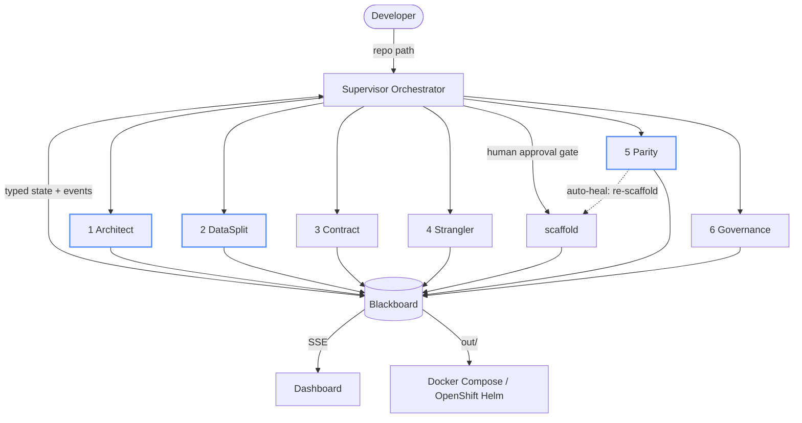

# RepoSplit 2.0 — Architecture

## Execution model

Phases are an explicit FSM (`core/fsm.py`). Forward edges only, except `PARITY -> SCAFFOLD`
for the healing loop. Every transition is recorded with a reason; every phase has an optional
gate (`core/supervisor.py::PHASE_GATES`) that can reject the run.

## Blackboard

`core/blackboard.py`. Thread-safe dict of Pydantic models keyed by `Keys.*`, plus:

- telemetry log (`TelemetryEvent`: ts, seq, phase, agent, level, message, payload) with async subscribers → SSE
- prompt records (agent, provider, model, sha256, used_default) → passport provenance
- artifact registry → passport subjects
- `save()` / `load()` JSON snapshot + `events.jsonl` after every phase

## Agents

| # | Agent | Phase | Deterministic core | LLM decision (schema) | Produces |
|---|---|---|---|---|---|
| 0 | Supervisor | all | FSM, gates, persistence, approval, heal loop | – | `run.*` |
| 1 | Architect | ARCHITECT | `ast` whole-repo parse → symbol graph; NetworkX Louvain; data-affinity refinement; Ca/Ce/I; Tarjan SCC; modularity | `ArchitectDecision` (rename clusters, risk, cut points) | `DependencyGraph`, `DomainTopology` |
| 2 | DataSplit | DATA | ORM model AST parse; table ownership by cluster; FK severance; saga synthesis from cross-service write calls (source order, compensation lexicon); CQRS projections from cross-service reads | `DataDecision` (saga review, risky severances) | `DataPartitionPlan`, isolated schemas, migration SQL, saga/cqrs/outbox modules |
| 3 | Contract | CONTRACT | public routes preserved; severed calls → internal POST RPC; severed data access → GET-by-id; OpenAPI 3.0 + proto3 | – | `ContractPlan` |
| 4 | Strangler | STRANGLER | Envoy `weighted_clusters` per route, outlier detection, staged plan, rollback controller | – | `GatewayPlan` |
| – | Scaffold | SCAFFOLD | Flask→FastAPI porter, Jinja2 service templates, compose, Helm | – | `ScaffoldManifest` |
| 5 | Parity | PARITY | ordered suite synthesis / traffic replay; local stack boot; differential runner; semantic diff with masks; heuristic healer | `HealDecision` (find/replace patches, needs_human) | `ParityReport` |
| 6 | Governance | GOVERNANCE | SHA-256 of tree/topology/plan/parity/prompts; in-toto v1 statement; DSSE + Ed25519; `did:key` | – | `MigrationPassport` |

## Key algorithms

**Instability** `I = Ce / (Ca + Ce)` per cluster over symbol edges (call, data_access, fk, inherits).

**Partition** (`agents/architect/graph_metrics.py::partition_symbols`)
1. Symbols from infrastructure modules (`app.py`, `db.py`, `config.py`, `seed.py` …) → shared kernel, removed from the graph.
2. Louvain on the undirected weighted symbol graph (seeded, deterministic).
3. Data-affinity refinement: a function moves to the community owning most of the models it touches; functions without data access follow their strongest call neighbours. Models anchor.
4. Name communities by a domain lexicon (user/catalog/order/payment/…), merge same-domain communities, absorb tiny ones into their strongest neighbour.

**Coupling score** `initial` = fraction of symbol-edge weight crossing *modules* (how tangled the monolith is); `severed` = fraction crossing *service clusters* after the cut.

**FK severance** drop the constraint, keep the column + add an index (`--uuid-refs` → `String(36)`). Same-service FKs are kept.

**Saga synthesis** for each write-path function with cross-service calls: forward steps in source order (reads and compensations excluded), compensation resolved via lexicon (`reserve→release`, `charge→refund`, …) and checked for existence in the owning cluster, plus a local `Finalize*` step.

**Parity** cases are dispatched to monolith and service, bodies normalized (masked keys, ISO datetimes, UUIDs, float rounding) and diffed structurally. Status mismatch or any structural diff fails the case.

**Passport** `PAE("DSSEv1", type, body)` signed with Ed25519; `reposplit verify` checks signature, embedded statement ↔ payload equality, signer DID ↔ key, and re-hashes every subject on disk.

## Failure recovery matrix (implemented)

| Scenario | Handling |
|---|---|
| Circular dependencies | Tarjan SCC on the cluster graph and on the module import graph → `DomainTopology.cycles` with a resolution note; overall risk raised |
| God `models.py` | symbol-level partition splits the file; `DataPartitionPlan.god_files` and `DomainTopology.split_files` record it |
| Non-deterministic responses | `semantic_diff.normalize` masks tokens/timestamps/UUIDs |
| Cross-DB JOIN | porter flags the function (`TODO(auto-heal)`), Parity fails the case, healer routes it to `parity_needs_human.md` with the projection name |
| LLM down / refuses / truncates | `decide()` falls back to the deterministic default and records `used_default=True` (or aborts with `--strict-llm`) |
| Service crash during live parity | case marked `ERROR`; gate fails only if *every* case errored |

## Extension points

- `LanguageParser` protocol (`ast_parser.py`) for JS/Go.
- `LLMProvider` (`llm/provider.py`) for another model host.
- `PHASE_GATES` for stricter acceptance criteria.
- `generators/templates/` for a different target framework (the porter is the only Flask/FastAPI-specific code).
